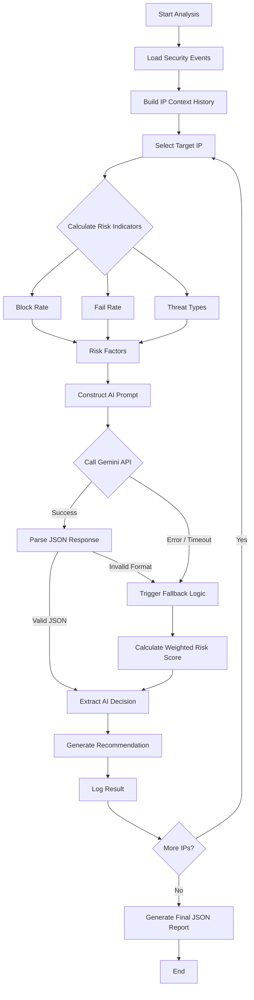

# 🔐 MCP-SIEM: Autonomous IP Threat Decision System using Generative AI

## 📌 Project Overview

**MCP-SIEM (Model Context Protocol for Security Event Intelligence)** is an **AI-driven cybersecurity decision-making system** designed to autonomously analyze security events from SIEM logs and decide whether a source IP address should be **BLOCKED or ACCEPTED**.

Traditional security systems generate large volumes of alerts that require manual analysis by security analysts. This project addresses that challenge by combining **contextual data aggregation, risk scoring, and Generative AI (Google Gemini)** to make **explainable, autonomous security decisions**.

---

## ❓ Problem Statement

Modern SIEM systems face several limitations:

- 🚨 Huge volume of security alerts
- ⏳ Manual triage is time-consuming and error-prone
- 📉 Rule-based firewalls lack contextual intelligence
- 🤖 Existing systems do not adapt or reason like a human analyst

**Security teams need an intelligent system that can:**
- Understand historical attack behavior
- Correlate multiple indicators per IP
- Make autonomous decisions with confidence levels
- Provide human-readable explanations for each action

---

## ✅ Solution Approach

This project implements an **Autonomous MCP Server** that:

1. **Ingests SIEM security events** from an Excel dataset which contains IP information like name, attack type, target address
   

2. **Builds historical context per IP address**
3. **Extracts risk indicators** such as:
   - Blocked attempts
   - Failed attempts
   - Threat types
   - Source countries
   - Targeted ports
4. **Uses Open AI API Key (GenAI)** to reason like a security analyst
5. **Falls back to rule-based logic** if AI fails
6. Produces:
   - Decision: `BLOCK` or `ACCEPT`
   - Confidence level
   - Risk score (0–100)
   - Clear reasoning
   - Actionable recommendations

---

## 🧠 Key Concepts Used

- **Model Context Protocol (MCP)** for contextual decision-making
- **Generative AI for cybersecurity reasoning**
- **Explainable AI (XAI)** for trust and auditability
- **Hybrid AI + Rule-Based architecture**
- **SIEM log correlation and enrichment**

---

## ⚙️ System Architecture & Workflow

---

## 📂 Project Components

- `mcpserver.py`  
  Core MCP Server that performs IP context building, AI analysis, fallback logic, and reporting.
  
> Note: Replace with your gemini API key where it says YOUR_GEMINI_API_KEY_HERE

- `security_events_3000.xlsx`  
  Sample SIEM-like dataset containing attack logs.

- `mcp_analysis_report.json`  
  Full structured output of AI decisions for all analyzed IPs.

- `mcp_summary.txt`  
  Human-readable summary report for SOC teams.

---

## 🔍 Decision Logic Explained

### 🔹 AI-Based Analysis
- Uses **Google Gemini 2.0 Flash**
- Considers historical behavior, not just single events
- Produces structured JSON output:
  - Decision
  - Confidence
  - Risk score
  - Reasoning

### 🔹 Rule-Based Fallback
If AI response fails or is malformed:
- Calculates risk using weighted metrics:
  - Block rate
  - Failure rate
- Ensures system reliability and safety

---

## 📊 Output Summary

From a run:

- **Total IPs Analyzed:** 100  
- **Blocked IPs:** 88  
- **Accepted IPs:** 12  
- **Average Risk Score:** 77.4/100  
- **High-Confidence Decisions:** 87  

Each IP decision includes:
- Context summary
- Risk score
- Human-readable explanation
- Recommended security action

Output in MCPsummary.txt

---

## 🎯 Why This Project Matters

This system demonstrates how **Generative AI can augment SOC operations**, not replace them.

### 🔐 Practical Impact
- Reduces alert fatigue
- Improves response time
- Adds reasoning and explainability
- Bridges gap between AI and real-world cybersecurity

### 🎓 Academic Value
- Demonstrates MCP concepts
- Combines ML, AI reasoning, and security analytics
- Suitable for research, thesis, or final-year projects

### 💼 Industry Relevance
- Aligns with SOC automation trends
- Relevant to roles in:
  - Cybersecurity
  - AI Engineering
  - Security Analytics
  - Threat Intelligence

---

## 🚀 Future Enhancements

- Real-time SIEM integration (Splunk / Elastic / Sentinel)
- Streaming log ingestion
- Reinforcement learning for adaptive thresholds
- Integration with firewalls and SOAR platforms
- Dashboard visualization

---

## 👨‍💻 Author

**Amar Kumar**  
B.Sc. Computer Science (Honours)  
University of Delhi  

Interests:
- Cybersecurity
- Generative AI
- AI Agents
- SOC Automation
- Applied Machine Learning

---

## 📜 Disclaimer

This project is developed for **educational and research purposes**.  
It is not intended to replace enterprise security controls without further validation.
